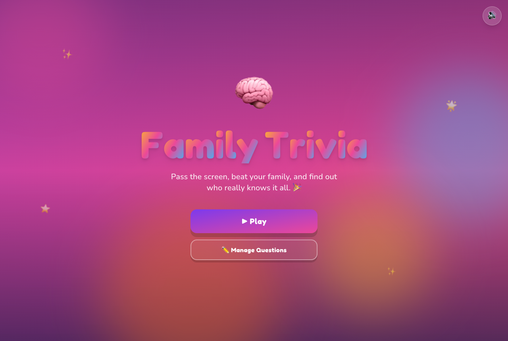

# 🧠 Family Trivia 🎉

A vibrant, animated **family trivia game** for shared-screen / pass-and-play. Add
your players, write your own questions, and battle it out with big tactile buttons,
spring animations, sound effects, confetti, and a winner's podium.



## ✨ Features

- **Pass-and-play** on one shared screen (laptop, tablet, or TV) — 1–8 players.
- **Your own questions** — built-in editor to add / edit / delete questions across
  custom categories, with **JSON import/export** and a curated starter pack.
- **Multiple-choice & true/false** questions with easy/medium/hard difficulty (harder
  questions are worth more points).
- **Playful visuals** — animated gradient background, floating blobs, springy motion,
  per-player avatars & colors.
- **Optional countdown timer** with a depleting ring and tension cues.
- **Full audio** — synthesized sound effects (correct / wrong / tick / whoosh / victory)
  and gentle background music, with a one-tap **mute** toggle. No audio files needed.
- **Halftime leaderboard** between turn cycles and a celebratory **podium + confetti**
  finale.
- Everything is saved to `localStorage` — your questions and players persist. Works
  fully offline; no backend, no API keys.

## 🚀 Getting started

```bash
npm install
npm run dev      # http://localhost:5173
```

Production build:

```bash
npm run build    # outputs static files to dist/
npm run preview  # preview the production build
npm run typecheck
```

Deploy the `dist/` folder to any static host (Netlify, Vercel, GitHub Pages).

## 🎮 How to play

1. **Play** → add players (name + emoji + color).
2. **Game Setup** → pick categories, difficulty, question count, and timer.
3. Take turns: the active player reads the question, taps an answer, and hits **Lock In**.
4. Correct answers score points (with confetti!). Pass the device to the next player.
5. See standings at halftime, then crown the winner on the podium.

Manage your question bank anytime from **Manage Questions** on the home screen.

## 🛠 Tech stack

- **Vite + React 18 + TypeScript**
- **Tailwind CSS** (custom playful theme)
- **Framer Motion** (springs, layout, page transitions)
- **Zustand** (state) · **canvas-confetti** (celebrations)
- **Web Audio API** for runtime-synthesized sound (zero audio assets)

## 📁 Project structure

```
src/
  store/gameStore.ts      # Zustand store: flow, players, questions, scoring
  data/starterQuestions.ts# built-in question pack
  hooks/                  # useAudio (synth engine), useCountdown
  lib/                    # storage (localStorage), shuffle
  components/
    ui/                   # Button, Card, Chip, Toggle, EmojiPicker, background, confetti
    game/                 # QuestionCard parts, CountdownRing, ScoreHUD, Leaderboard, Podium
    screens/              # Home, Setup, Config, Play, RoundScore, Results, Library
```
